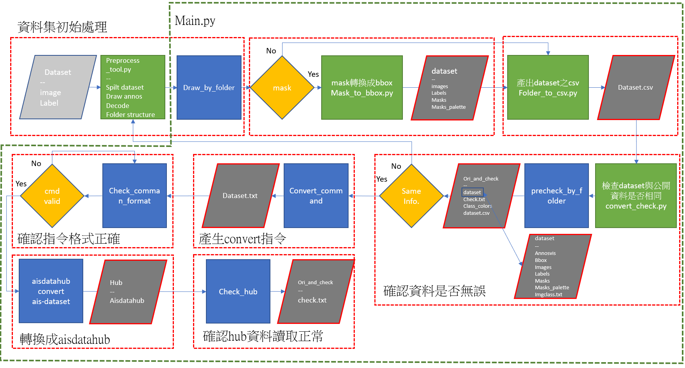

# Data engineering utils

## Overview

This project aims to convert a target dataset into a specific datahub format. We have designed four main scripts to accomplish this conversion process, ensuring the dataset is correctly parsed and output to datahub.

## Environment setup

Python version: 3.8
Necessary Python modules: See requirements.txt

## Installation

git clone http://172.22.137.46:8000/ditgit/department3/algorithm_section/alg_intern_2022/utilities.git

## Usage

python main.py              -p 路徑 -sp 儲存路徑 -sn 儲存名稱

python preprocess_tool.py   -p 路徑 -sp 儲存路徑 -m 功能選擇

python mask_to_bbox.py      -p 路徑 -sp 儲存路徑 -sn 儲存名稱

python folder_to_csv.py     -p 路徑

python convert_check.py     -p 路徑 -sp 儲存路徑 -m 功能選擇

## Script Desriptions

圖片資料夾名稱必須只包含'image'，mask資料夾名稱必須只包含'mask'，bbox資料夾名稱必需只包含'label'

main.py: 畫出標註圖片 -> 將masks轉換成bboxes -> 產生dataset的csv -> 產生dataset的資訊，產生轉換的指令，執行轉換指令，確認轉換結果

preprocess_tool.py: 資料夾結構紀錄，畫出標註圖片結果，整理轉換所需的資料夾，劃分train、test資料集

mask_to_bbox.py: 將masks轉換成bbox

folder_to_csv.py: 產生datatset的csv

convert_check.py: 產生dataset的資訊，產生轉換的指令，執行轉換指令，確認轉換結果

==== Source ====
alg_eval_utility.py  @+c214778eb43dc563187ba280de4f6465cacc7dbc algarch (1.0.1-52-gc214778)
